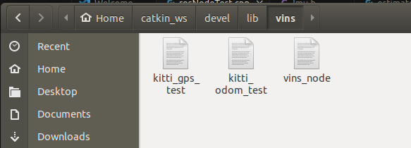

# VINS-Fusion Code-Learn

## 1. 程序入口 rosNodeTest.cpp
入口 **vins_estimator\src\rosNodeTest.cpp**

### 1.1 定义内容

运行程序时，首先进入的是主程序`vins_estimator/src/estimator/rosNodeTest.cpp`
里边主要定义了 **估计器**、 **缓存器** 、 **获取传感器数据**的函数 和 一个**主函数**

```c++ 
// 获得左目的message
void img0_callback(const sensor_msgs::ImageConstPtr &amp;img_msg)
// 获得右目的message
void img1_callback(const sensor_msgs::ImageConstPtr &amp;img_msg)
// 从ros msg中获取图片，返回值cv::Mat，输入是当前图像msg的指针
cv::Mat getImageFromMsg(const sensor_msgs::ImageConstPtr &img_msg)
// 从两个主题中提取具有相同时间戳的图像
// 并将图像输入到估计器中
void sync_process()
{
    ...
    estimator.inputImage(time, image0, image1);
    ....
}
// 输入imu的msg信息，进行解算并把imu数据输入到estimator
void imu_callback(const sensor_msgs::ImuConstPtr &imu_msg)
{
    ...
    estimator.inputIMU(t, acc, gyr);
    ...
}
// 把特征点的点云msg输入到estimator
void feature_callback(const sensor_msgs::PointCloudConstPtr &feature_msg)
{
    ...
    estimator.inputFeature(t, featureFrame);
    ...
}
// 是否重启estimator，并重新设置参数
void restart_callback(const std_msgs::BoolConstPtr &restart_msg)
// 是否使用IMU
void imu_switch_callback(const std_msgs::BoolConstPtr &switch_msg)
// 相机的开关
void cam_switch_callback(const std_msgs::BoolConstPtr &switch_msg)

/* 主函数 */
int main(int argc, char **argv)
```

### 1.2 程序执行
*运行相关可执行文件*


*运行命令*
**Monocualr camera + IMU**

```sh
roslaunch vins vins_rviz.launch
rosrun vins vins_node ~/catkin_ws/src/VINS-Fusion/config/euroc/euroc_mono_imu_config.yaml 
(optional) rosrun loop_fusion loop_fusion_node ~/catkin_ws/src/VINS-Fusion/config/euroc/euroc_mono_imu_config.yaml 
rosbag play YOUR_DATASET_FOLDER/MH_01_easy.bag
```
#### 1.2.1 获取参数并设置参数
主函数中，主要是执行以下各个步骤订阅ROS信息，然后进行处理
```c++
ros::init(argc, argv, "vins_estimator");  // 初始化ROS节点
/* ros::NodeHandle n("~");
在上述代码中，我们创建了一个名为n的ros::NodeHandle对象，并将其初始化为使用当前节点的私有命名空间。
具体来说，"~"是一个特殊的字符串，表示ROS节点的私有命名空间。在ROS中，每个节点都有一个全局命名空间
和一个私有命名空间。全局命名空间由ROS主节点定义，而私有命名空间由各个节点自行定义。通过使用私有命名
空间，节点能够在更高的层次上组织其参数和话题
*/
ros::NodeHandle n("~");  // 创建ROS节点句柄

/*
这行代码是在ROS（Robot Operating System）中设置日志级别的操作。具体来说，它将日志记录器的级别设置为Info级别。

在ROS中，日志级别用于控制输出的详细程度。不同的级别包括Debug、Info、Warn、Error和Fatal，级别从低到高逐渐增加。通过设置日志级别，你可以决定要输出哪个级别及以上的日志消息。

在这行代码中，ROSCONSOLE_DEFAULT_NAME 是ROS内部使用的默认日志记录器名称，而ros::console::levels::Info 则是一个表示Info级别的枚举值。通过调用ros::console::set_logger_level函数，将默认日志记录器的级别设置为Info，这意味着只有Info级别及以上的日志消息会被输出。
*/
ros::console::set_logger_level(ROSCONSOLE_DEFAULT_NAME, ros::console::levels::Info);

if(argc != 2)
{
    printf("please intput: rosrun vins vins_node [config file] \n"
            "for example: rosrun vins vins_node "
            "~/catkin_ws/src/VINS-Fusion/config/euroc/euroc_stereo_imu_config.yaml \n");
    return 1;
}

string config_file = argv[1];
...
readParameters(config_file);// 读取参数
estimator.setParameter();// 设置参数
...

```

#### 1.2.2 重要函数

##### imu_callback

这段代码是一个IMU数据的回调函数，用于处理传感器消息中的加速度和角速度数据。

函数接受一个指向`sensor_msgs::Imu`类型消息的常量指针`imu_msg`作为输入参数。

首先，通过`imu_msg->header.stamp.toSec()`获取了消息的时间戳，并将其存储在变量`t`中。

接下来，从`imu_msg`中获取了线性加速度的三个分量`dx`、`dy`和`dz`，以及角速度的三个分量`rx`、`ry`和`rz`。

然后，使用Eigen库的`Vector3d`类型，将获得的加速度和角速度数据分别存储在名为`acc`和`gyr`的向量中。

最后，执行了`vins_estimator/src/estimator/estimator.cpp`的`inputIMU`函数中的`fastPredictIMU` `pubLatestOdometry`函数，将时间戳、加速度和角速度数据作为参数传递给该方法进行处理。

整个函数的目的是将传感器消息中的IMU数据提取出来并传递给名为`estimator`的对象进行后续处理。

```C++
void imu_callback(const sensor_msgs::ImuConstPtr &imu_msg)
{
    double t = imu_msg->header.stamp.toSec();
    double dx = imu_msg->linear_acceleration.x;
    double dy = imu_msg->linear_acceleration.y;
    double dz = imu_msg->linear_acceleration.z;
    double rx = imu_msg->angular_velocity.x;
    double ry = imu_msg->angular_velocity.y;
    double rz = imu_msg->angular_velocity.z;
    Vector3d acc(dx, dy, dz);
    Vector3d gyr(rx, ry, rz);
    estimator.inputIMU(t, acc, gyr);
    return;
}
```

###### **fastPredictIMU**

定义 **vins_estimator/src/estimator/estimator.cpp**

[详解IMU预积分——VINS中的预积分 - 猛女瘦瘦的文章 - 知乎](https://zhuanlan.zhihu.com/p/534577566)

**IMU预积分的作用**：（位置P，速度V，姿态Q(四元数表示)）

- 消除第i时刻，也就是上一帧的PVQ值对IMU积分的影响；

- 保留重力影响

```c++
void Estimator::fastPredictIMU(double t, Eigen::Vector3d linear_acceleration, Eigen::Vector3d angular_velocity)
{
    double dt = t - latest_time;
    latest_time = t;
    Eigen::Vector3d un_acc_0 = latest_Q * (latest_acc_0 - latest_Ba) - g;
    Eigen::Vector3d un_gyr = 0.5 * (latest_gyr_0 + angular_velocity) - latest_Bg;
    latest_Q = latest_Q * Utility::deltaQ(un_gyr * dt);
    Eigen::Vector3d un_acc_1 = latest_Q * (linear_acceleration - latest_Ba) - g;
    Eigen::Vector3d un_acc = 0.5 * (un_acc_0 + un_acc_1);
    latest_P = latest_P + dt * latest_V + 0.5 * dt * dt * un_acc;
    latest_V = latest_V + dt * un_acc;
    latest_acc_0 = linear_acceleration;
    latest_gyr_0 = angular_velocity;
}
```

**消除第i时刻，也就是上一帧的PVQ值对IMU积分的影响**；

## 2. 图像输入 estimator.cpp

vins_estimator\src\estimator\estimator.cpp

​	

## 链接

[旋转向量、旋转矩阵、欧拉角 - 手写AI的文章 - 知乎](https://zhuanlan.zhihu.com/p/401806150)

[四元数，旋转矩阵，欧拉角互转（python）](https://blog.csdn.net/weixin_45024226/article/details/125114042)

[详解IMU预积分——VINS中的预积分 - 猛女瘦瘦的文章 - 知乎](https://zhuanlan.zhihu.com/p/534577566)

